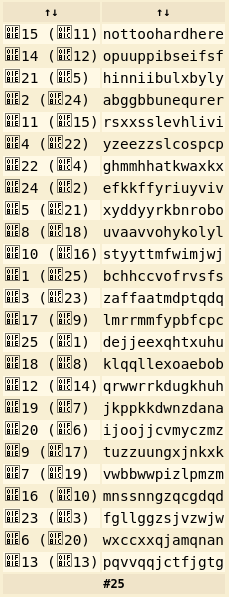

# Level00

Once connected, our first instinct is to check the content of the home directory for the current user.

```bash
level00@SnowCrash:~$ ls -la
total 12
dr-xr-x---+ 1 level00 level00  100 Mar  5  2016 .
d--x--x--x  1 root    users    340 Aug 30  2015 ..
-r-xr-x---+ 1 level00 level00  220 Apr  3  2012 .bash_logout
-r-xr-x---+ 1 level00 level00 3518 Aug 30  2015 .bashrc
-r-xr-x---+ 1 level00 level00  675 Apr  3  2012 .profile
```

After checking the available files, nothing looks suspicious.  
We then try to list all files owned by flag00 with the `find` command.

```bash
level00@SnowCrash:~$ find / -type f -user flag00 2>/dev/null
/usr/sbin/john
/rofs/usr/sbin/john
```
This reveals 2 files named `john`, which seem to refer to a [password cracker tool](https://www.openwall.com/john/).

```bash
level00@SnowCrash:~$ cat /usr/sbin/john
cdiiddwgpswtgt
level00@SnowCrash:~$ cat /rofs/usr/sbin/john
cdiiddwpgswtgt
```

But using the content of these files as the flag doesn't work. What if the string was encoded?  
We use the [dCode](https://www.dcode.fr) website (a tool suggested in the intra video for this project) in order to potentially find the encryption's technique which has used to generate this token.  
After testing the string against the most popular ones, we get a decent match using the [Caesar cipher](https://en.wikipedia.org/wiki/Caesar_cipher).



```bash
level00@SnowCrash:~$ su flag00
Password: 
Don't forget to launch getflag !
flag00@SnowCrash:~$ getflag
Check flag.Here is your token : x24ti5gi3x0ol2eh4esiuxias
```
